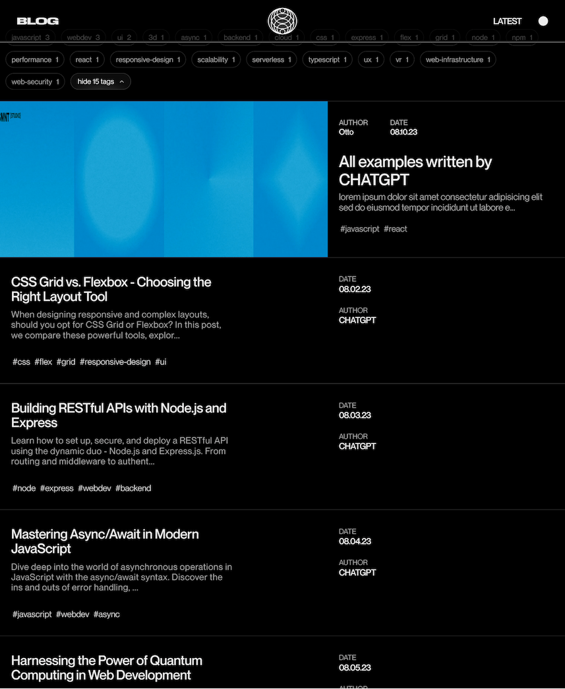
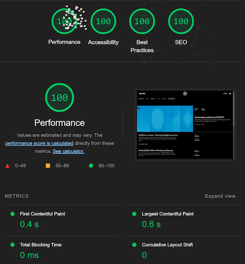

# Next.js Blog with Contentlayer

## Work in progress

<!--  -->


---

## Table of Contents

- [Features](#features)
- [Installation](#installation)
- [MDX](#mdx)
- [Types & Interfaces](#types--interfaces)
- [Plugins](#plugins)
- [Fonts](#fonts)
- [CSS](#css)
- [Linting](#linting)
- [License](#license)

---

### Installation

```bash
git clone https://github.com/chaseottofy/nextjs-blog.git
cd nextjs-blog
npm install
```

## Features


#### Accessibility

Passes the following audits:

- lighthouse performance/a11y/seo/best practices (100%)
- NU HTML Checker (100%)
- PageSpeed Insights audit (100%)
- WCAG 2.1 AA/AAA contrast ratio requirements (100%)

#### Contentlayer

- Makes for an easy CMS-like experience for posts.
- MDX -> JSON -> TypeScript

#### Next.js

- Utilizes the latest Next.js features, including the new App Router

#### CSS Modules

- Aside from resets, variables, and global styles, all CSS is modularized and scoped to the component it's used in.

#### TypeScript

- 100% TypeScript with predominate use of interfaces.

#### 100% lighthouse score




I do not consider this an optimized app, nextjs is really throwing me a loop with the performance. The score may say 100%, but there is undoubtedly a bottle-neck somewhere, and it's probably something I did.

<!-- Even with the loss, by just doing little things like using local fonts and WEBP images, 100% lighthouse is very easy to achieve.
Browsers love webp images especially, don't ask me why, but they do. 

Getting aria-labels right is the easiest part of the whole process. Lighthouse for some reason only requires an aria-label on a specific set of elements and then calls it a day. They don't care if the label is actually useful or not because a single aira-label doesn't even make a difference in the first place. Google just wants to see that you are a good little developer who follows the rules.

As for meta tags, you may want to actually take those serious for SEO purposes, lighthouse only cares for the description and title tags but there are a lot more that you should be using.

CSS rarely makes a difference, I've found that for every 10,000 lines of CSS, you might lose .1s on the speed index. It's so insignificant that I don't even really bother with it anymore for optimization purposes.

Lastly, use inline SVGs whenever possible and avoid icon libraries. The problem with Icon libraries is they normally do one of the following:
- Use a font file
- Import the entire library for one icon
- Have the base height, width, and viewport set to a ridiculous size like 1024x1024
- Have cluttered IDs/Classes/Styles that are not needed but are still there to make the library work for everyone -->

<!-- I've found that [Vercal](https://vercel.com/design/icons) have the best SVGs, not to mention the website allows you to copy the SVGs directly, where as google material icons want you to download a zip file like it's 2005.

If vercel doesn't have what I need, I just copy the outer-html from SVGs on [react-icons](https://react-icons.github.io/react-icons/search). -->

## MDX

- MDX is a superset of markdown that allows you to use JSX components inside of markdown.
- Used in coherence with `contentlayer` and `next-contentlayer` to create a CMS-like experience.

All MDX files are located in the `@/posts` folder

### MDX Schema

At the top of each MDX file is a list of properties that are used to create the post.
- They are 100% customizable and are typed in the `contentlayer.config.ts` file in the root directory.
- My example schema is below, make sure to add the `---` at the top and bottom of the schema without any spaces.
- Things like extra whitespace or forgetting to add 2 spaces will cause information to not be parsed correctly.

Other than the first init block, the rest of the file is regular markdown.

```MDX
---
title: All examples written by CHATGPT
date: '2023-08-10T11:30:30'
author: otto
authorLink: https://chaseottofy.github.io/Portfolio/
excerpt: lorem ipsum dolor sit amet consectetur adipisicing elit sed do eiusmod tempor incididunt ut labore et dolore magna aliqua
banner: '/images/posts/post-01.webp'
bannerHueRotate: '180deg'
isFeatured: true
isArchived: false
tags: 
  - javascript
  - react
---
```

### Featured Posts

- contentlayer param featured (boolean)

Featured posts will have their banner image displayed on the home page.
`@app/layout.tsx` - If you would also like to display the featured posts first on the home page, set the second parameter of `getPostsSorted` to `true`.

```JSX
const startPosts = getPostsSorted('asc', true);
```

- Featured posts have two additional properties to be aware of: `banner` | `bannerHueRotate`

`banner`: Direct path to the image file i.e. `banner: '/images/featured-post.jpg'`
`bannerHueRotate`: CSS filter value i.e. `bannerHueRotate: 'hue-rotate(10deg)'`

### Supplying App with Posts

Calls to post data must be made within client-side components. I chose to do this in my very outermost client component, `@app/layout.tsx`. By doing this, I only ever make one call to retrieve the posts.

- `children` represents the top-level of all components that directly descend from `<main>`.
- In order to pass the posts to all children, a singular time, I added the parameter `params` and explicitly added a prop to attach the posts to it.
- `<Header>` and `{children}` receive the same posts, one time.

```JSX
const RootLayout: React.FC<RootLayoutInterface> = ({
  children,
  params,
}) => {
  const startPosts = getPostsSorted('asc', true);
  params.startPosts = startPosts;
}

return (
  <html>
    <body>
      <ThemeProvider>
        <Header posts={startPosts} />
        <main>{children}</main>
        <Footer />
      </ThemeProvider>
    </body>
  </html>
);
```

## Types & Interfaces

- All types and interfaces used more than once are in the @/models/interfaces.ts file.
- All types and interfaces used only once are in the file they are used in.

## Plugins

- `contentlayer` : Bridge between MDX and TypeScript
- `next-contentlayer` : Next.js plugin for contentlayer
- `@code-hike/mdx` : MDX plugin that helps style code blocks
- `date-fns` : Date formatting and ISO parsing ( no additional date-fn plugins )
- `nanoid` : Generate unique key IDs for React
- `sharp` : Image processing ( no need to do anything with this one next.js automatically uses it )
- `next-themes` : Theme provider for Next.js

## Fonts

- I got these fonts from a graphic designer friend and don't know if they require licensing, I don't really care since I'm not planning on making any money off this but if you are, you should probably look into it.

## CSS

- 90% of the CSS is modularized and scoped to the component it's used in.
- The rest ( resets / variables / global ) are in the `styles` folder.
- There is also one instance of third party CSS imported in `@app/posts/[slug]/page.tsx` for the code blocks.

## Linting

- I do not recommend you keep my eslint config, it's currently total overkill as I'm still fine-tuning my preferences for TSX after vanilla for so long. Depending on which stage I'm at in the project it also could look completely different.
- I'd point you in the direction of a decent config if I had one. Most senior devs I've asked look at me weird when I passionately bring up my eslint config problems. Is linting a noob thing? I don't know, but it definitely helps me learn best practices and catches stupid mistakes. Rant over.

## License
MIT License

Copyright (c) 2023 Chase Ottofy

Permission is hereby granted, free of charge, to any person obtaining a copy
of this software and associated documentation files (the "Software"), to deal
in the Software without restriction, including without limitation the rights
to use, copy, modify, merge, publish, distribute, sublicense, and/or sell
copies of the Software, and to permit persons to whom the Software is
furnished to do so, subject to the following conditions:

The above copyright notice and this permission notice shall be included in all
copies or substantial portions of the Software.

THE SOFTWARE IS PROVIDED "AS IS", WITHOUT WARRANTY OF ANY KIND, EXPRESS OR
IMPLIED, INCLUDING BUT NOT LIMITED TO THE WARRANTIES OF MERCHANTABILITY,
FITNESS FOR A PARTICULAR PURPOSE AND NONINFRINGEMENT. IN NO EVENT SHALL THE
AUTHORS OR COPYRIGHT HOLDERS BE LIABLE FOR ANY CLAIM, DAMAGES OR OTHER
LIABILITY, WHETHER IN AN ACTION OF CONTRACT, TORT OR OTHERWISE, ARISING FROM,
OUT OF OR IN CONNECTION WITH THE SOFTWARE OR THE USE OR OTHER DEALINGS IN THE
SOFTWARE.
