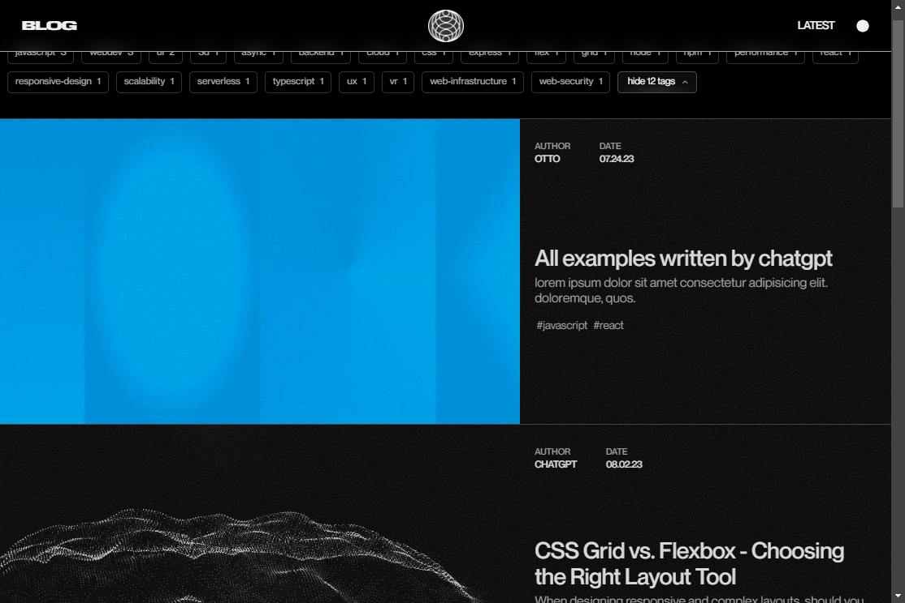
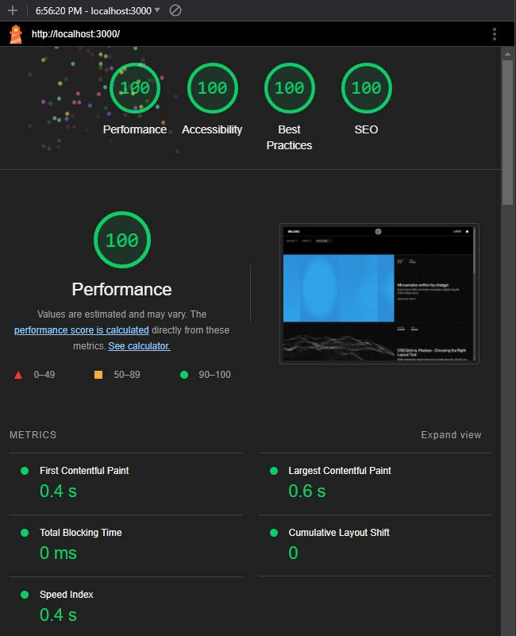
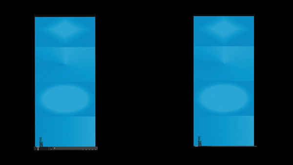

# Next.js Blog with Contentlayer

> **Warning**
> This project is still a work in progress and is not ready for production use.

- Currently finishing up post styling
- None of the current posts are mine, they are just placeholders for now.



---

## Table of Contents

- [Deploying](#Deploying)
- [Features](#features)
  - [Image Handling](#custom-image-handling-system)
  - [Accessibility](#accessibility)
  - [Contentlayer](#contentlayer)
  - [Next.js](#nextjs)
  - [CSS Modules](#css-modules)
  - [TypeScript](#typescript)
  - [Optimized](#optimized)
- [Installation](#installation)
- [MDX](#mdx)
  - [MDX Schema](#mdx-schema)
  - [Featured Posts](#featured-posts)
  - [Supplying App with Posts](#supplying-app-with-posts)
- [Images](#images)
- [Types & Interfaces](#types--interfaces)
- [Plugins](#plugins)
- [Fonts](#fonts)
- [CSS](#css)
- [Linting](#linting)
- [License](#license)

---

### Deploying

There is one bug to be aware of that may or may not be on my end.

When it comes to the build process on vercel, font paths are not being resolved correctly. All other assets are perfectly fine, but for some reason, unless the font is in root of the `/app` directory, vercel will not be able to find it and the build will fail. This is not a problem when running or building the project locally.

Vercel and Nextjs both provide guides that I've linked below for help with similar issues to this
- [guide: nextjs module not found](https://nextjs.org/docs/messages/module-not-found)
- [guide: vercel module not found](https://vercel.com/guides/how-do-i-resolve-a-module-not-found-error)

**TL,DR: "make sure you spelled everything right"**

*They do provide a nice reminder that some filesystems are case-insensitive, which really flares up my existential dread more than most things...*

## Features

#### Custom Image Handling System

- Automatically generate base64 data urls for all post images.
- Images are cached and will not be regenerated unless the image file is modified.

#### Accessibility

Passes the following audits:

- lighthouse performance/a11y/seo/best practices (100%)
- NU HTML Checker (100%)
- PageSpeed Insights audit (100%)
- WCAG 2.1 AA/AAA contrast ratio requirements (100%)

#### Contentlayer

- Makes for an easy CMS-like experience for posts.
- MDX -> JSON -> TypeScript

#### Next.js

- Utilizes the latest Next.js features
  - New `/app` directory
- Next.js is not the fastest framework I've ever used but it's the best one I've ever used.

#### CSS Modules

- Aside from resets, variables, and global styles, all CSS is modularized and scoped to the component it's used in.

#### TypeScript

- 100% TypeScript with predominate use of interfaces.

#### Optimized

- 100% lighthouse score
- Tested with disabled cache and simulated base throttling
- 0.0s cumulative layout shift across all pages



## MDX

- MDX is a superset of markdown that allows you to use JSX components inside of markdown.
- Used in coherence with `contentlayer` and `next-contentlayer` to create a CMS-like experience.

All MDX files are located in the `@/posts` folder

### MDX Schema

At the top of each MDX file is a list of properties that are used to create the post.
- They are 100% customizable and are typed in the `contentlayer.config.ts` file in the root directory.
- My example schema is below, make sure to add the `---` at the top and bottom of the schema without any spaces.
- Things like extra whitespace or forgetting to add 2 spaces will cause information to not be parsed correctly.

Other than the first init block, the rest of the file is regular markdown.

```MDX
---
title: All examples written by CHATGPT
date: '2023-08-10T11:30:30'
author: otto
authorLink: https://chaseottofy.github.io/Portfolio/
excerpt: lorem ipsum dolor sit amet consectetur adipisicing elit sed do eiusmod tempor incididunt ut labore et dolore magna aliqua
banner: '/images/posts/post-01.webp'
isFeatured: true
isArchived: false
tags: 
  - javascript
  - react
---
```

### Featured Posts

- contentlayer param featured (boolean)

Featured posts will have their banner image displayed on the home page.
`@app/layout.tsx` - If you would also like to display the featured posts first on the home page, set the second parameter of `getPostsSorted` to `true`.

```JSX
const startPosts = getPostsSorted('asc', true);
```

- Featured posts have one additional image property to be aware of: `banner`

`banner`: Direct path to the image file i.e. `banner: '/images/featured-post.jpg'`

### Supplying App with Posts

Calls to post data must be made within client-side components. I chose to do this in my very outermost client component, `@app/layout.tsx`. By doing this, I only ever make one call to retrieve the posts.

- `children` represents the top-level of all components that directly descend from `<main>`.
- In order to pass the posts to all children, a singular time, I added the parameter `params` and explicitly added a prop to attach the posts to it.
- `<Header>` and `{children}` receive the same posts, one time.

```JSX
const RootLayout: React.FC<RootLayoutInterface> = ({
  children,
  params,
}) => {
  const startPosts = getPostsSorted('asc', true);
  params.startPosts = startPosts;
}

return (
  <html>
    <body>
      <ThemeProvider>
        <Header posts={startPosts} />
        <main>{children}</main>
        <Footer />
      </ThemeProvider>
    </body>
  </html>
);
```

## Images

**All images are in the `public/images` folder.**

> **Warning**
> Before using the image parser, make sure to configure the `ImageConfig` class within the `scripts/img-parser.mjs` file to match your images folder structure and desired output schema.

- Within the `scripts` folder is a useful node script that generates placeholder images from a specified folder to a specified placeholder folder.
- This script also can generate base64 data urls for the placeholder images, and output them as an object in either a typescript, json, or mdx file.
- The generated base64 string can be used in the `placeholder` prop of the `<Image>` component in nextjs to prevent screen flashing when loading images. Nextjs has a built in feature to easily incorporate this technique by simply supplying the base64 data url under the `placeholder` prop of the `<Image>` component. The generated base64 data is cached directly in memory and is often around 300 bytes.

The script is located in `scripts/img-parser.mjs` - The following CLI commands are available:

1. Create both placeholder images and base64 data urls:
```bash
npm run parseimg
```

2. Create placeholder images only:
```bash
npm run parseimg:placeholders
```

3. Create base64 data urls from placeholders only:
```bash
npm run parseimg:base64
```

An example of the generated base64 data url object is below. The key is name of the original image file, and the value is the base64 data url of the placeholder image for that file. The outputted object itself will be in a generated file of specified type and location.
```TS
const imagePlaceholders = {
  "post-01": "data:image/webp;base64,UklGRqAAAABXRUJQVlA4IJQAAABQBgCdASp4ADQAP83i6W8/tjGuJBQMS/A5iWMAy6QANzVkMe/6zQl6bimj+ABd/WW1rl03B5JW6htFAADkbp+DjCar5D8jsIbsKGD+2dih3ULc2kxX+7nALoJEgZ6YUqv4M84JNd3d8sjBNrkFg+FCfVf14QM54Y0k3SjL1loua3I/yhu2fdkCSTWwSNSeAAS4AAAA",
  "post-02": "data:image/webp;base64,UklGRu4AAABXRUJQVlA4IOIAAAAQCQCdASrAAFMAP83m63I/t7+/oIpD8DmJZW7dXOCAAuWnctTTwgBi/CEliZNRdPeeVs9YJUQjuDZwfcbseXJJOJl/JTBPhd5c6uKRd6ITVAAA5Fd583sj+BfjCar5D+R2EN2GbgPxIb+rwVEAD00qlBlcqxNyE7LAdQ37q3R4UQvaeEtNVIQo3MUgygOJw9a1fq3s1NkotEv37bwHGx23s6U+FYGeLkwJ4fgU/pmBFgMs0GyYnoGyCd4LdLHD51nSEjpNJpR7HAghj5veaC6EkVM2cKxkCZzXhAwqeCCAAAAA"
};
export default imagePlaceholders;
```

To retrieve the placeholder, simply import the object and use the post slug as the key.

```JSX
import imagePlaceholders from '@/data/image-placeholder.ts';
const postImagePlaceholder = imagePlaceholders[post.paramsAsSlug];
```

Then supply the placeholder to the `<Image>` component.

```JSX
<Image 
  src={post.banner}
  placeholder={postImagePlaceholder}
/>
```

Or alternatively, use it both as the placeholder and as a content fallback.

```JSX
<Image 
  src={post?.banner ? post.banner : placeholderImageSrc}
  placeholder={postImagePlaceholder}
/>
```

Below is an example of the difference it can make. This becomes more noticeable when caching is disabled.



---

## Types & Interfaces

- All types and interfaces used more than once are in the @/models/interfaces.ts file.
- All types and interfaces used only once are in the file they are used in.

## Plugins

- `contentlayer` : Bridge between MDX and TypeScript
- `next-contentlayer` : Next.js plugin for contentlayer
- `sharp` : Image processing ( no need to do anything with this one next.js automatically uses it )
- `next-themes` : Theme provider for Next.js

## Fonts

- I got these fonts from a graphic designer friend and don't know if they require licensing, I don't really care since I'm not planning on making any money off this but if you are, you should probably look into it.

## CSS

- 90% of the CSS is modularized and scoped to the component it's used in.
- The rest ( resets / variables / global ) are in the `styles` folder.

## Linting

- Very strict linting rules that I'm sure you'll want to change.
- I'm using a lot of rules to help familiarize myself with TSX after years of hardcore vanilla.
- Many of them are **not** automatically fixable and will prevent the build from proceeding past the linting stage.
- Save yourself the headache and configure your own rules in the `.eslintrc.json` file.

## License
MIT License

Copyright (c) 2023 Chase Ottofy

Permission is hereby granted, free of charge, to any person obtaining a copy
of this software and associated documentation files (the "Software"), to deal
in the Software without restriction, including without limitation the rights
to use, copy, modify, merge, publish, distribute, sublicense, and/or sell
copies of the Software, and to permit persons to whom the Software is
furnished to do so, subject to the following conditions:

The above copyright notice and this permission notice shall be included in all
copies or substantial portions of the Software.

THE SOFTWARE IS PROVIDED "AS IS", WITHOUT WARRANTY OF ANY KIND, EXPRESS OR
IMPLIED, INCLUDING BUT NOT LIMITED TO THE WARRANTIES OF MERCHANTABILITY,
FITNESS FOR A PARTICULAR PURPOSE AND NONINFRINGEMENT. IN NO EVENT SHALL THE
AUTHORS OR COPYRIGHT HOLDERS BE LIABLE FOR ANY CLAIM, DAMAGES OR OTHER
LIABILITY, WHETHER IN AN ACTION OF CONTRACT, TORT OR OTHERWISE, ARISING FROM,
OUT OF OR IN CONNECTION WITH THE SOFTWARE OR THE USE OR OTHER DEALINGS IN THE
SOFTWARE.
